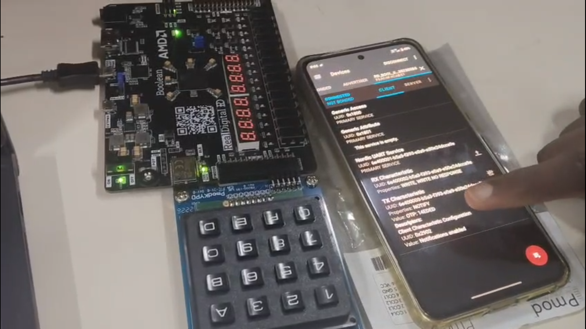

# FPGA-Based Secure Authentication System Using TRNG-Driven OTP Generation

A Verilog HDL implementation of a secure, hardware-based authentication system on the **Xilinx Spartan-7 FPGA**, integrating a **4×4 matrix keypad**, **Bluetooth Low Energy (BLE)**, and **UART** interfaces. At its core, a **True Random Number Generator (TRNG)** drives the generation of a 6-character **One-Time Password (OTP)**, verified through a dedicated control module to provide enhanced protection against replay and prediction attacks.



---

##  Key Features

- **TRNG-based OTP generation** — 6-character one-time password generated using a hardware true random number generator core.
- **4×4 matrix keypad interface** — for manual OTP entry and PIN input.
- **BLE integration** — enables wireless OTP transmission/reception for remote authentication.
- **UART communication** — sends OTP and status data to a host system/serial monitor.
- **Soft reset circuitry** — allows safe reinitialization of the authentication logic without a full power cycle.
- **Modular RTL design** — each function (keypad, OTP logic, UART, reset) is implemented as an independent, reusable module.
- **Validated in Xilinx Vivado** — functionally simulated and verified on Spartan-7 hardware.

---

##  System Architecture

The design follows a modular RTL architecture:

```
                ┌────────────────┐
                │   trng_core.v   │  → Generates random seed for OTP
                └───────┬────────┘
                        │
                ┌───────▼─────────────┐
                │ otp_lock_controller.v│ → OTP generation, verification, lock logic
                └───────┬─────────────┘
                        │
       ┌────────────────┼───────────────────┐
       │                │                   │
┌──────▼──────┐  ┌───────▼────────┐  ┌───────▼────────┐
│ keypad_scan.v│  │ otp_uart_sender.v│ │ keypad_reset.v │
│ (4x4 keypad) │  │ (sends OTP/UART) │ │ (soft reset)   │
└──────────────┘  └───────┬────────┘  └────────────────┘
                           │
                    ┌──────▼──────┐
                    │  uart_tx.v   │ → Physical UART transmission
                    └─────────────┘

                ┌────────────────┐
                │keypad_ble_top.v │ → Top-level integration (keypad + BLE + OTP + UART)
                └────────────────┘
```

---

## 📂 Module Descriptions

| File | Description |
|---|---|
| `keypad_ble_top.v` | Top-level module integrating keypad, BLE, OTP, and UART subsystems. |
| `keypad_scan.v` | Scans and debounces the 4×4 matrix keypad, decodes key presses. |
| `keypad_reset.v` | Implements soft reset logic to reinitialize system state safely. |
| `trng_core.v` | Hardware True Random Number Generator core used as OTP entropy source. |
| `otp_lock_controller.v` | Core OTP control logic — generation, timeout, verification, and lock/unlock decision. |
| `otp_uart_sender.v` | Formats and forwards generated OTP data to the UART transmit module. |
| `uart_tx.v` | Low-level UART transmitter for serial data output. |
| `keypad.xdc` | Xilinx Design Constraints file — pin mapping for keypad, UART, and BLE I/O on Spartan-7. |
| `fpga_auth.png` | System block diagram / architecture illustration. |

---

## 🛠️ Tools & Platform

- **Hardware:** Xilinx Spartan-7 FPGA
- **HDL:** Verilog
- **Toolchain:** Xilinx Vivado (Synthesis, Implementation, Simulation)
- **Interfaces:** 4×4 Matrix Keypad, BLE Module, UART

---

## ✅ Validation

- Functional simulation performed for all modules in Vivado.
- OTP generation and verification logic tested for correctness and timing.
- Keypad debounce and scan logic verified against bounce/glitch conditions.
- UART transmission verified using a serial terminal at the target baud rate.
- Soft reset tested to confirm safe state reinitialization without full power cycle.

---

## 🚀 Future Scope

- Add encrypted BLE communication for OTP transmission.
- Extend OTP length/complexity and add configurable expiry timers.
- Add LCD/OLED display support for on-device OTP feedback.
- Integrate with a mobile app for remote OTP requests over BLE.

---

## 👤 Author

**Di-nesh-design**
